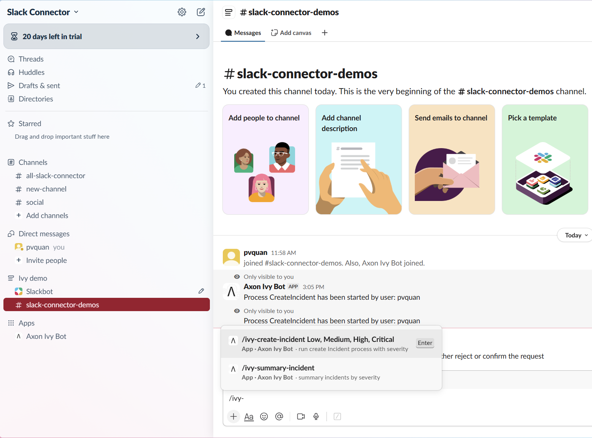
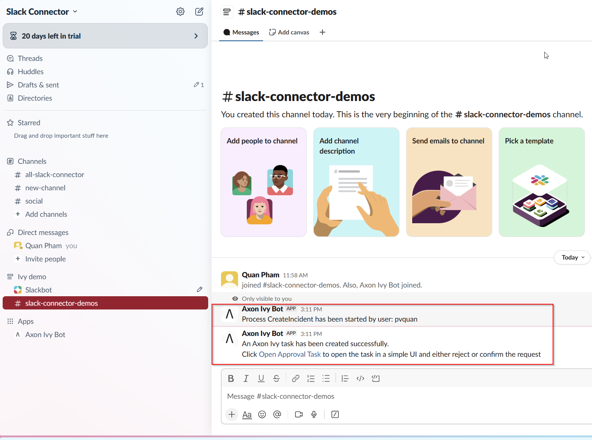
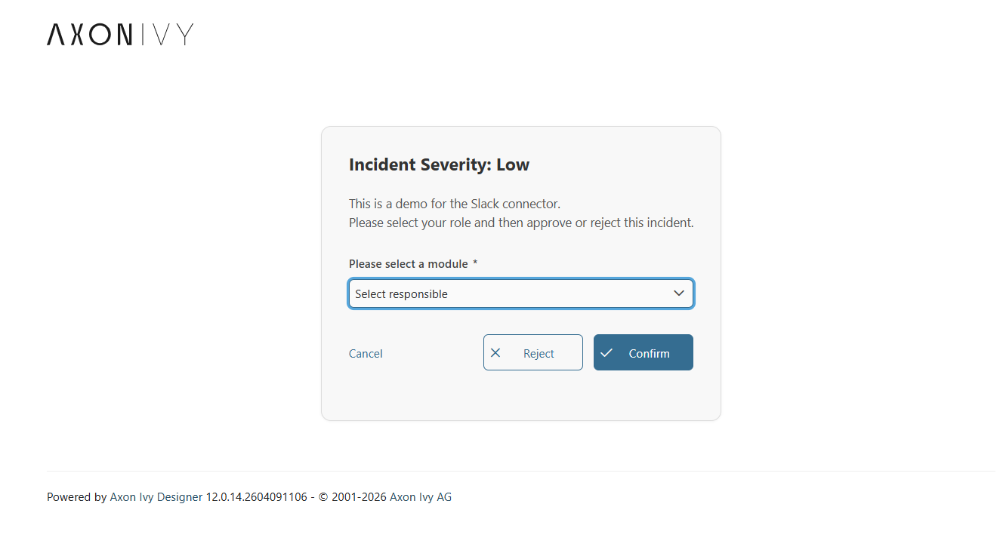
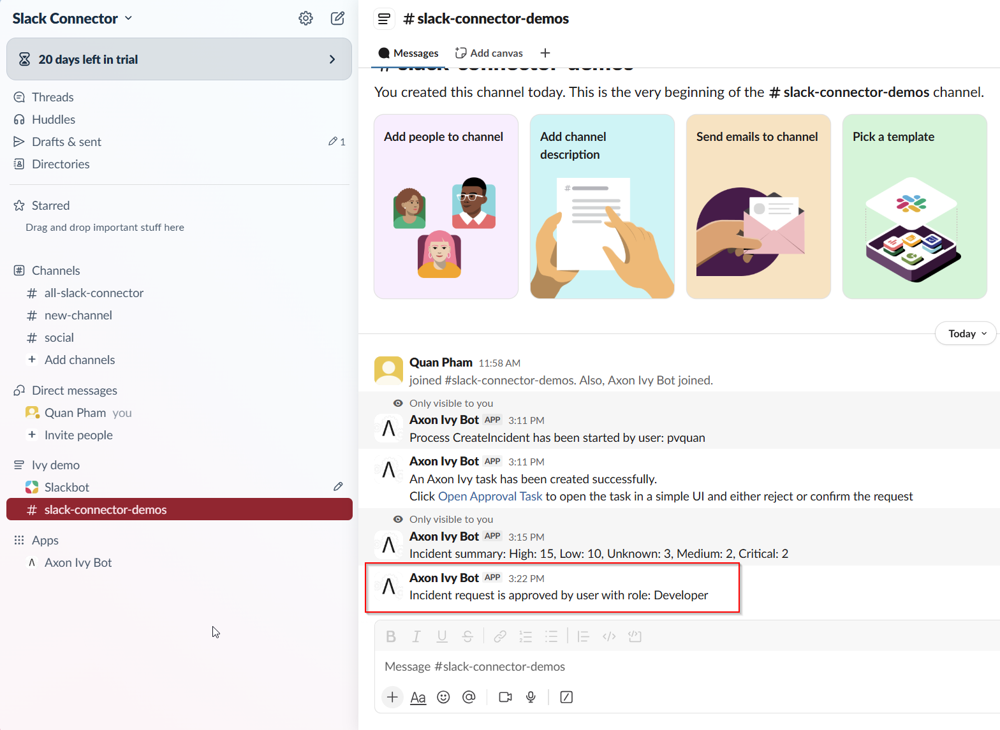
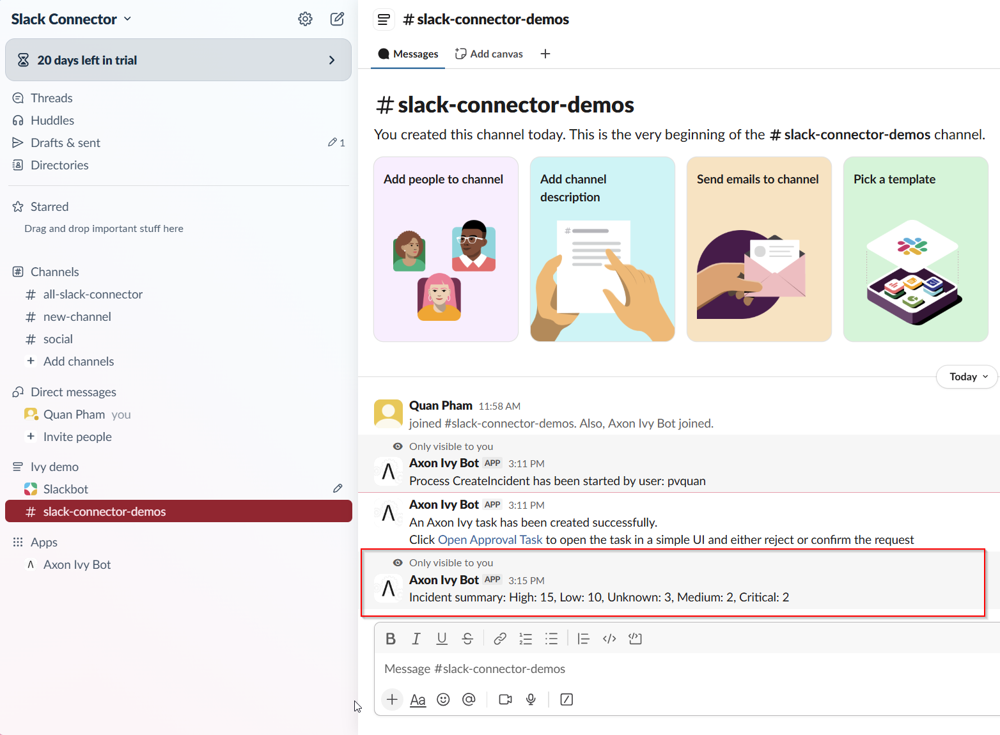
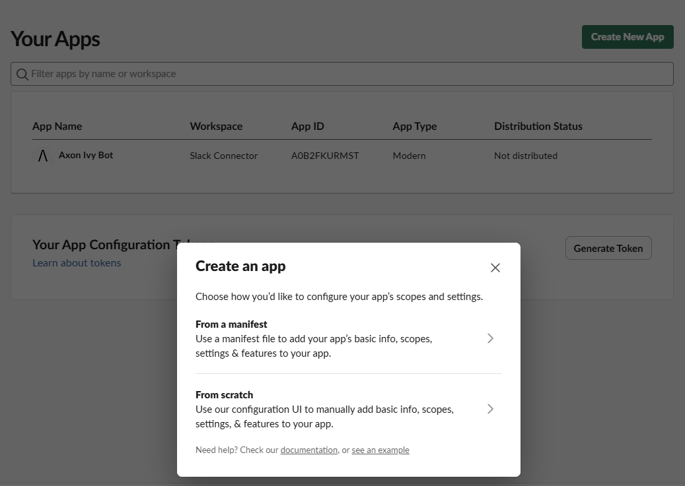
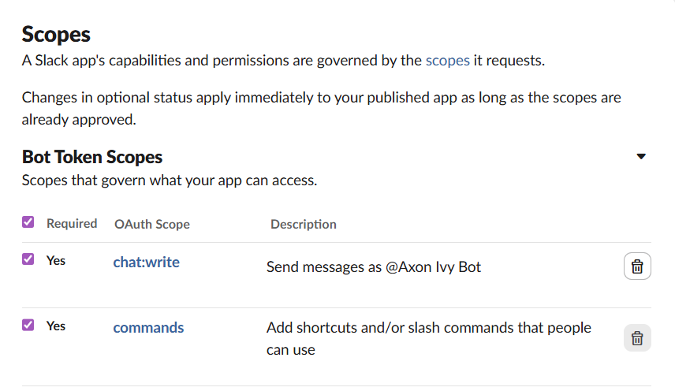
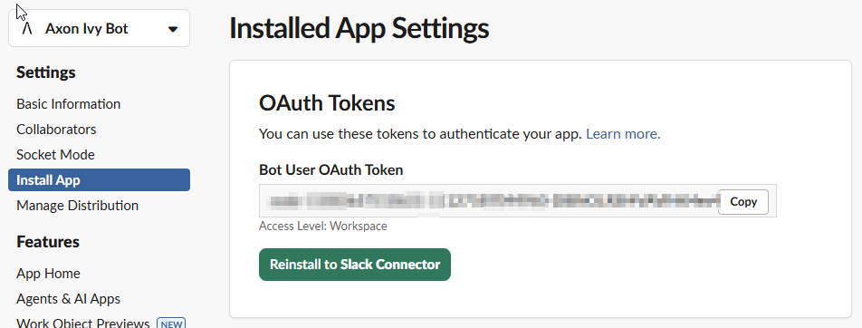
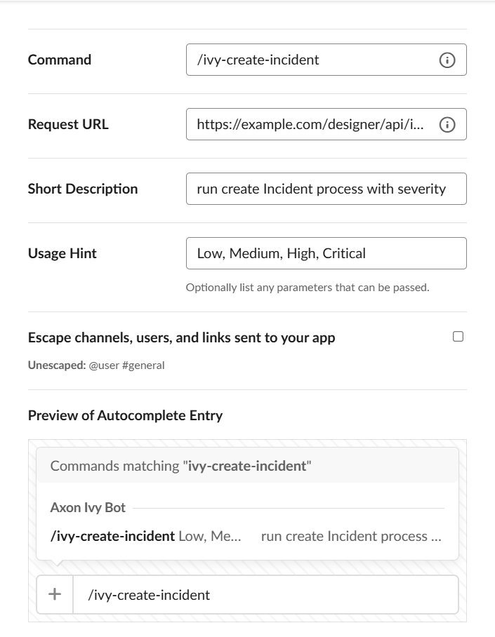

# Slack Connector

Der Slack Connector integriert Axon Ivy mit Slack und ermöglicht es Prozessen, Nachrichten zu senden, Slash-Commands zu verarbeiten und Workflows direkt aus Slack-Kanälen und von Slack-Benutzern auszulösen. Er stellt einen aufrufbaren Subprozess zum Senden von Nachrichten, eine kleine Java-Hilfs-API und Demo-Workflows bereit, damit du die Integration schnell evaluieren und erweitern kannst.

[](https://github.com/axonivy-market/slack-connector/actions/workflows/ci.yml)

### Wichtigste Funktionen

- Sende Nachrichten an Slack-Kanäle und Threads direkt aus Axon Ivy-Prozessen und ermögliche so automatisierte Benachrichtigungen und Alerts.
- Einfache Java-Hilfs-API (`MessageService`), um Nachrichten programmatisch aus Java-Code und Prozessskripten zu senden.
- Verarbeite Slack-Slash-Commands, um interaktive Workflows wie die Incident-Erstellung direkt aus Slack zu starten.
- Demo-Implementierungen zum Erstellen von Incidents und Öffnen von Freigabeaufgaben, damit du die Lösung schnell evaluieren kannst.
- Einfache Konfiguration über Produktvariablen und sofort nutzbare Demo-Installer für ein schnelles Setup.

## Demo

Das Demo-Modul zeigt, wie Slack-Commands, Axon Ivy-Fälle und Slack-Bot-Antworten in einem Incident-Ablauf zusammenspielen. Nutze es, um die End-to-End-Erfahrung zu prüfen, bevor du den Connector in deine eigenen Prozesse integrierst.

### Demo-Workflows

#### slack-connector-demo (slack-connector-demo)

##### Incident aus Slack erstellen

1. Öffne einen Slack-Kanal, in dem deine App installiert ist, und führe `/ivy-create-incident` mit einer Severity wie `Low`, `Medium`, `High` oder `Critical` aus.



2. Slack sendet das Formular an den Demo-REST-Endpunkt und Axon Ivy startet den Fall `CreateIncident` für den aktuellen Benutzer.



3. Öffne die Freigabeaufgabe aus der Slack-Nachricht, prüfe die Incident-Details und wähle im Dialog die verantwortliche Rolle.



4. Bestätige oder lehne die Anfrage ab. Das Demo postet die Entscheidung mit der gewählten Rolle zurück in den ursprünglichen Slack-Kanal.



5. Führe `/ivy-summary-incident` aus, um eine schnelle Severity-Zusammenfassung der aktuell laufenden Incidents in Slack zu erhalten.



##### Task Listener starten

1. Starte den Installer-Einstieg `Task listener` aus dem Demo-Modul.
2. Lasse den Listener laufen, während du in Axon Ivy Aufgaben erstellst oder zuweist.
3. Prüfe die Slack-Benachrichtigungen, die gesendet werden, sobald neue Freigabeaufgaben verfügbar sind.

## Setup

- **Roles:** Everybody (konfiguriert in `config/roles.xml`)
- **OpenAPI:** Slack-Web-API-Spezifikation unter https://github.com/slackapi/slack-api-specs/blob/master/web-api/slack_web_openapi_v2.json mit Namespace `com.slack.api.client`

### Variablen

```yaml
# yaml-language-server: $schema=https://json-schema.axonivy.com/app/12.0.0/variables.json
Variables:
  com:
    axonivy:
      connector:
        slack:
          # the base url for Slack api
          baseUrl: https://slack.com/api
          notification:
            # enables the Slack notification for new tasks
            enabled: "true"
          # the token from Slack bot
          botToken: ""
```

1. Installiere die Connector-Artefakte in deiner Axon Ivy-Umgebung.

- Importiere `slack-connector` für die Kernintegration.
- Importiere zusätzlich `slack-connector-demo`, wenn du die Beispiel-Slash-Commands, den Dialog und den Task Listener nutzen willst.

2. Erstelle die Slack-App, die deinen Axon-Ivy-Bot repräsentiert.

- Öffne https://api.slack.com/apps und klicke auf **Create New App**.
- Wähle **From scratch**, vergebe einen Namen wie `Axon Ivy Bot` und wähle den Ziel-Workspace aus.



3. Füge die Bot-Scopes hinzu, die der Connector benötigt.

- Öffne **OAuth & Permissions** in deiner Slack-App.
- Füge `chat:write` hinzu, damit der Bot Incident-Updates posten kann.
- Füge `commands` hinzu, damit Slack die Slash-Commands ausführen kann.
- Ergänze `chat:write.public`, wenn der Bot auch in öffentliche Kanäle posten soll, bevor er eingeladen wurde.



4. Installiere die App im Workspace und kopiere das Bot-Token.

- Öffne **Install App** und autorisiere die App für deinen Workspace.
- Kopiere das **Bot User OAuth Token**, das nach der Installation angezeigt wird.
- Speichere dieses Token in der Axon Ivy-Variable `com.axonivy.connector.slack.botToken`.
- Halte den Wert aus der Versionsverwaltung heraus und ersetze lokale Test-Tokens, bevor du das Projekt teilst.



5. Erstelle die Slash-Commands, die das Demo verwendet.

- Öffne **Features** -> **Slash Commands** und klicke auf **Create New Command**.
- Erstelle den Slash-Command, zum Beispiel `/ivy-create-incident`, und setze die Request URL auf deine öffentliche benutzerdefinierte Axon Ivy-URL.
- Ein Usage Hint wie `Low, Medium, High, Critical` kann verwendet werden, um Parameter von Slack an die Axon Ivy-Anwendung zu übergeben.
- Installiere die App erneut, wenn Slack nach dem Speichern der Commands eine Aktualisierung der Berechtigungen verlangt.



## Components

### Connector processes

#### SendBotMessage.p.json

- **sendBotMessage(String message, String channel, String botToken) -> out: com.axonivy.connector.slack.SendBotMessageData**
  - Input:
    - `message` (String)
    - `channel` (String)
    - `botToken` (String)

### Form Components

#### IncidentDetailDialog — Incident-Anfragen aus Slack prüfen und bearbeiten

- **Namespace:** `com.axonivy.connector.slack.IncidentDetailDialog`
- **Component type:** HTML_DIALOG
- **Fields:**
  - `channel` — Slack-Kennung des Kanals, in den die Antwort zurückgesendet wird
  - `severity` — Severity des Incidents, die aus dem Slash-Command übernommen wird
  - `responsible` — Gewählte Rolle, die bei Bestätigung oder Ablehnung in den Workflow zurückgegeben wird
- **Where used:** `CreateIncident` Demo-Workflow
- **Purpose:** Zeigt das Incident-Freigabeformular an, lässt den Benutzer die verantwortliche Rolle wählen und sendet die Entscheidung zurück nach Slack.

### Maven artifacts

1. com.axonivy.connector.slack.connector:slack-connector (@version@)

```xml
<dependency>
  <groupId>com.axonivy.connector.slack.connector</groupId>
  <artifactId>slack-connector</artifactId>
  <version>@version@</version>
  <type>iar</type>
</dependency>
```

2. com.axonivy.connector.slack.connector:slack-connector-demo (@version@) _(optional)_

```xml
<dependency>
  <groupId>com.axonivy.connector.slack.connector</groupId>
  <artifactId>slack-connector-demo</artifactId>
  <version>@version@</version>
  <type>iar</type>
</dependency>
```
